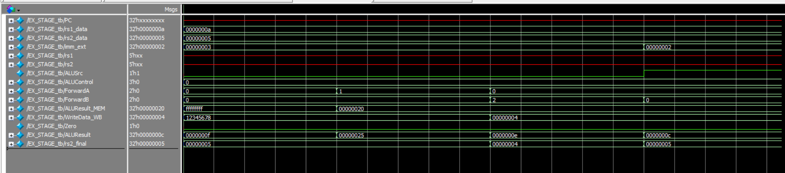

# EX_STAGE – Execute Stage with Forwarding (RISC-V Pipeline)

## Overview

The Execute (EX) stage is responsible for performing arithmetic, logic, or address calculations in a pipelined processor. In a real pipeline, data hazards can occur when instructions depend on values that are not yet written back. To solve this, the EX_STAGE integrates **forwarding logic** to select the correct operand sources dynamically.

---

## Core Responsibilities

1. **Operand Selection (with Forwarding)**
   - Chooses operand A (`SrcA`) for the ALU based on `ForwardA`:
     - From register file, MEM stage, or WB stage
   - Chooses operand B (`SrcB`) based on:
     - `ForwardB` and `ALUSrc` (select between `rs2` or `imm_ext`)

2. **ALU Operation**
   - Performs the required arithmetic/logic operation
   - Outputs result (`ALUResult`) and sets the `Zero` flag for branches

3. **rs2 Forwarding**
   - `rs2_final` output handles correct value for store operations (e.g., `sw`)

---

## Inputs

- `rs1_data`, `rs2_data`: Original operands from the register file
- `imm_ext`: Immediate value extended from instruction
- `ALUControl`: Operation to perform
- `ALUSrc`: Selects between immediate and forwarded `rs2`
- `ForwardA`, `ForwardB`: Control signals from the Forwarding Unit
- `ALUResult_MEM`, `WriteData_WB`: Forwarded data sources
- `PC`, `rs1`, `rs2`: Optional passthrough inputs

---

## Outputs

- `ALUResult`: Output of the ALU
- `Zero`: Indicates if the ALU result is zero
- `rs2_final`: Correct value to pass to MEM stage for stores

---

## Forwarding MUX Logic

| ForwardA/B | Source           |
|------------|------------------|
| `00`       | Register file     |
| `01`       | ALUResult from MEM stage |
| `10`       | WriteData from WB stage  |

---

## Example Testbench Scenarios

| Case | ForwardA | ForwardB | ALUSrc | Expected ALUResult |
|------|----------|----------|--------|---------------------|
| 1    | 00       | 00       | 0      | rs1 + rs2           |
| 2    | 01       | 00       | 0      | ALUResult_MEM + rs2 |
| 3    | 00       | 10       | 0      | rs1 + WriteData_WB  |
| 4    | 00       | xx       | 1      | rs1 + imm_ext       |

---

## Wave View
