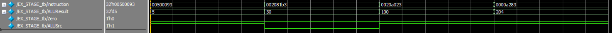

# EX_STAGE – Execute Stage (RISC-V Pipeline)

## Overview

The Execute (EX) stage is the third step in the 5-stage RISC-V pipeline. Its main function is to perform arithmetic and logic operations using the ALU. This includes operations such as addition, subtraction, comparisons, and address calculations for memory instructions.

## Core Responsibilities

The EX stage receives decoded information from the ID stage and produces key results used in later stages. It performs:

1. **ALU Operation**
   - Takes in two operands: one from register `rs1`, and one that is either `rs2` or an immediate value, depending on the `ALUSrc` signal.
   - Performs operations determined by the `ALUControl` signal (e.g., add, sub, and, or, slt).
   - Outputs the result as `ALUResult`.

2. **Zero Flag Generation**
   - Outputs a `Zero` signal that is high if the result of the ALU is zero.
   - This flag is typically used in conditional branches (e.g., beq, bne).

3. **Data Forwarding**
   - Passes `rs2_data` directly to the next stage for store instructions (`sw`).
   - Passes `rd` and optionally `PC` and `instruction` to maintain continuity in the pipeline.

---

## Inputs

- `rs1_data`: Value from register `rs1`.
- `rs2_data`: Value from register `rs2`.
- `imm_ext`: Immediate value sign-extended from ID.
- `ALUSrc`: Control signal to select between `rs2_data` and `imm_ext` as ALU operand B.
- `ALUControl`: 3-bit code that determines the ALU operation.
- `rd_in`: Destination register address to be forwarded.
- `PC_in`: Optional, forwarded for jump or debugging.
- `instruction`: Optional, for debugging or hazard detection.

---

## Outputs

- `ALUResult`: Result of the ALU operation.
- `Zero`: High if `ALUResult` is zero.
- `rs2_data_out`: Forwarded to the MEM stage (used by store instructions).
- `rd_out`: Forwarded to the WB stage.
- `PC_out`: Optional PC passthrough.
- `instruction_out`: Optional passthrough for identification or debugging.

---

## Testbench Notes

The testbench validates core operations using:
- Register-to-register addition (R-type)
- Register + immediate addition (I-type)
- Address calculation for store (S-type)

## Wave View
