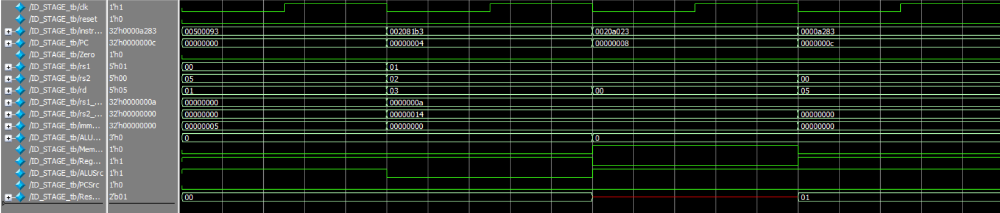

# ID_STAGE – Instruction Decode Stage (RISC-V Pipeline)

## Overview

The Instruction Decode (ID) stage is the second step in a 5-stage RISC-V pipeline. Its main role is to interpret the fetched instruction, extract register indices and immediate values, and generate control signals that guide the behavior of the next stages (EX, MEM, WB).

---

## Core Responsibilities

The ID stage performs the following operations:

1. **Instruction Field Extraction**
   - Breaks down the 32-bit instruction into its components:
     - `rs1`, `rs2`: source registers
     - `rd`: destination register (if applicable)
     - `opcode`, `funct3`, `funct7`: used to determine instruction type and operation

2. **Register File Access**
   - Reads the contents of `rs1` and `rs2` from the register file.
   - These values are used in ALU operations or stored in memory in later stages.

3. **Immediate Generation**
   - For instructions that require an immediate operand (e.g., `addi`, `lw`, `sw`), the ID stage extracts and sign-extends the appropriate bits from the instruction.
   - The immediate format depends on the instruction type (I-type, S-type, etc.).

4. **Control Signal Generation**
   - Based on the instruction type and function codes, the control unit generates signals such as:
     - `RegWrite`: whether to write to a register
     - `MemWrite`: whether to write to memory
     - `ALUSrc`: selects between register and immediate for ALU
     - `ResultSrc`: selects the source of the value to write back
     - `ALUControl`: determines the ALU operation
     - `PCSrc`: for conditional branches

---

## Example Instructions Tested

The testbench for this stage included a variety of instruction types to ensure complete coverage:

- `addi x1, x0, 5`: An I-type ALU instruction that uses an immediate and writes the result to a register.
- `add x3, x1, x2`: An R-type ALU instruction that performs register-to-register addition.
- `sw x2, 0(x1)`: An S-type instruction that stores the value of a register into memory.
- `lw x5, 0(x1)`: An I-type load instruction that loads data from memory into a register.

Each of these instructions was used to verify that the ID stage correctly parsed the instruction, accessed the appropriate register values, generated the correct immediate, and activated the necessary control signals.

## Wave View
