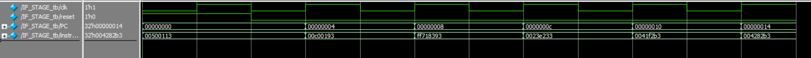

# IF Stage (Instruction Fetch) - RISC-V Pipeline

## Overview

The **Instruction Fetch (IF)** stage is the first stage of the pipeline in a RISC-V processor. Its main function is to fetch the instruction from instruction memory using the current value of the Program Counter (PC). Then, the PC is incremented to point to the next instruction.

---

## Observed Signals

| Signal         | Description                                      |
|----------------|--------------------------------------------------|
| `clk`          | Clock signal. State changes occur on rising edge.|
| `reset`        | Reset signal (active high).                      |
| `PC`           | Current Program Counter value.                   |
| `instruction`  | Instruction fetched from memory.                 |

---

## Simulation Behavior

Below is the cycle-by-cycle behavior observed in the waveform:

| Clock Cycle | `PC`        | `instruction` |
|-------------|-------------|----------------|
| 0           | `0x00000000`| `0x00500113`    |
| 1           | `0x00000004`| `0x00c00193`    |
| 2           | `0x00000008`| `0xff718393`    |
| 3           | `0x0000000C`| `0x0023e233`    |
| 4           | `0x00000010`| `0x0041f2b3`    |
| 5           | `0x00000014`| `0x004282b3`    |

 The PC increases by 4 bytes per cycle, since RISC-V instructions are 32-bit (4 bytes) wide.

---

## Expected Operation

1. **Fetch**: Access instruction memory using the `PC`.
2. **Read Instruction**: Read the instruction at the `PC` address.
3. **PC += 4**: Update the `PC` to point to the next instruction.
4. **Output**: Propagate `PC` and `instruction` to the next pipeline stage (ID).

## Wave View

