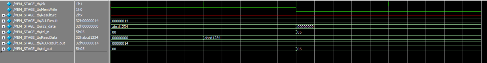

# MEM_STAGE – Memory Access Stage (RISC-V Pipeline)

## Overview

The MEM (Memory Access) stage is the fourth step in a standard 5-stage RISC-V pipeline. Its main function is to interact with data memory. It handles memory read and write operations based on the type of instruction, and passes necessary data forward to the WB (Write Back) stage.

---

## Core Responsibilities

1. **Memory Read**
   - If the instruction is a `lw` (load word), the memory address is given by the ALU result, and the stage outputs the value read from memory as `ReadData`.

2. **Memory Write**
   - If the instruction is a `sw` (store word), the value from register `rs2_data` is written into the memory location specified by `ALUResult`.
   - The write is enabled by the `MemWrite` control signal.

3. **Passthroughs**
   - `ALUResult` is forwarded in case the instruction does not interact with memory (e.g., arithmetic operations).
   - `rd` is passed along to indicate the target register for write-back.
   - Both values are critical for correct operation of the `WB_STAGE`.

---

## Inputs

- `clk`: Clock signal for synchronous memory operations.
- `MemWrite`: Enables memory write when high.
- `ResultSrc`: Used later to decide between memory and ALU result.
- `ALUResult`: Address calculated in the EX stage.
- `rs2_data`: Data to be written into memory (used by `sw`).
- `rd_in`: Register address to write to (used by `lw`).

---

## Outputs

- `ReadData`: Data read from memory (for `lw`).
- `ALUResult_out`: Passed forward to be selected in `WB_STAGE` if the instruction doesn't use memory.
- `rd_out`: Register address passed along for write-back in WB.

---

## Memory Structure

The data memory used in this stage is a simple array of 1024 words (4KB total). It supports:
- Combinational reads
- Synchronous writes (on clock edge when `MemWrite` is active)

---

## Wave View
