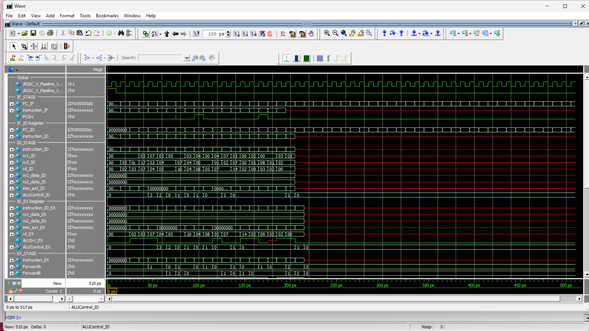
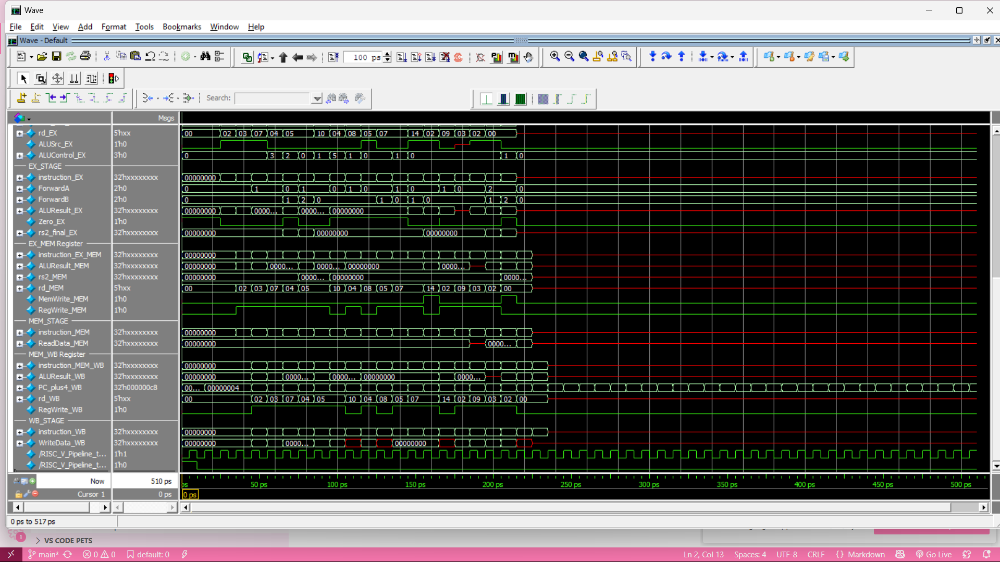

# README: RISC-V Pipeline Processor

This document describes the design, compilation, simulation, and waveform analysis of a **5-stage RISC-V pipeline processor**, including hazard detection and forwarding.

---

# Directory Structure

```
project_root/
├── rtl/
│   ├── IF_STAGE.v
│   ├── IF_ID.v
│   ├── ID_STAGE.v
│   ├── ID_EX.v
│   ├── Forwarding_Unit.v
│   ├── EX_STAGE.v
│   ├── EX_MEM.v
│   ├── data_memory.v
│   ├── MEM_WB.v
│   ├── WB_STAGE.v
│   └── RISC_V_Pipeline_Processor.v    ← Top-level module
├── tb/
│   └── RISC_V_Pipeline_tb.v           ← Testbench
├── wave.do                            ← Script to set up waveform
└── README.md
```

---

## Instruction Flow Through 5 Stages

1. ### IF (Instruction Fetch)  
   - **Module**: `IF_STAGE.v`  
   - Computes PC and fetches instruction from instruction memory.  
   - Pipeline register: `IF_ID.v` captures `(PC, instruction)`.

2. ### ID (Instruction Decode + Register File)  
   - **Module**: `ID_STAGE.v`  
   - Decodes `rs1/rs2/rd`, extends immediate, and generates control signals:  
     - `ALUSrc`, `MemWrite`, `RegWrite`, `ResultSrc`, `ALUControl`.  
   - Pipeline register: `ID_EX.v` captures operands, immediate, PC, control signals, and instruction.

3. ### EX (Execute / ALU)  
   - **Module**: `Forwarding_Unit.v`  
     - Resolves data hazards using `RegWrite` from MEM/WB stages.  
   - **Module**: `EX_STAGE.v`  
     - Executes ALU with multiplexers for forwarding and `ALUSrc`.  
     - Produces `ALUResult` and `Zero` flag.  
   - Pipeline register: `EX_MEM.v` captures `ALUResult`, data to write, `rd`, control signals, and instruction.

4. ### MEM (Memory Access)  
   - **Module**: `data_memory.v`  
     - Data memory for load/store.  
   - Pipeline register: `MEM_WB.v` captures read data, `ALUResult`, `PC+4`, `rd`, control signals, and instruction.

5. ### WB (Writeback)  
   - **Module**: `WB_STAGE.v`  
     - Selects between `ALUResult`, memory data, or `PC+4` using `ResultSrc`.  
     - Generates `WriteData` for the register file.

---

## Forwarding & Hazard Detection

- **Forwarding Unit** (`Forwarding_Unit.v`):  
  - Signals `ForwardA` / `ForwardB` resolve EX-stage hazards using MEM/WB data.
---

## Prerequisites

- **ModelSim / Questa** (v10.4c or newer) or any Verilog simulator.  
- Verilog toolchain (Vivado Simulator also works).

---

# Wave Views

