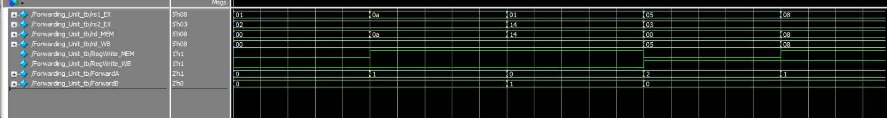

# Forwarding_Unit – Data Hazard Resolution (RISC-V Pipeline)

## Overview

The `Forwarding_Unit` is a key component of a pipelined processor responsible for resolving **data hazards** through **forwarding (bypassing)**. It allows operand values required in the EX stage to be forwarded directly from later stages (MEM or WB), rather than waiting for them to be written to the register file.

---

## Problem Solved: Data Hazards

Data hazards occur when an instruction depends on the result of a previous instruction that has not yet completed its write-back. Without forwarding, the processor would need to stall, reducing performance.

Example:
```assembly
add x1, x2, x3
sub x4, x1, x5  // Data hazard: x1 is not ready yet
```

---

## Operation

The forwarding unit inspects the current instruction in the EX stage and compares its source registers (`rs1`, `rs2`) with the destination registers (`rd`) of instructions in the MEM and WB stages. If a match is detected and the write-back is enabled, it selects the correct forwarding path.

---

## Inputs

- `rs1_EX`, `rs2_EX`: Source registers of the instruction currently in the EX stage.
- `rd_MEM`: Destination register of the instruction in the MEM stage.
- `rd_WB`: Destination register of the instruction in the WB stage.
- `RegWrite_MEM`, `RegWrite_WB`: Write-back enable signals from MEM and WB stages.

---

## Outputs

- `ForwardA`: Control signal for `SrcA` input to the ALU.
- `ForwardB`: Control signal for `SrcB` input to the ALU.

### Encoding:

| Value | Meaning               |
|-------|------------------------|
| `00`  | Use value from register file (no hazard) |
| `01`  | Forward from MEM stage |
| `10`  | Forward from WB stage  |

---

## Priority Rule

If both MEM and WB stages have a match, MEM takes priority because it holds the most recent value.

---

## Example Cases (from testbench)

| rs1_EX | rs2_EX | rd_MEM | rd_WB | RegWrite_MEM | RegWrite_WB | ForwardA | ForwardB |
|--------|--------|--------|--------|---------------|--------------|----------|----------|
| 10     | 2      | 10     | 0      | 1             | 0            | 01       | 00       |
| 5      | 3      | 0      | 5      | 0             | 1            | 10       | 00       |
| 8      | 3      | 8      | 8      | 1             | 1            | 01       | 00       |

---

## Wave View

