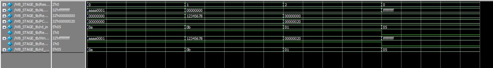

# WB_STAGE – Write Back Stage (RISC-V Pipeline)

## Overview

The Write Back (WB) stage is the fifth and final step in the RISC-V 5-stage pipeline. Its primary role is to select the correct value to be written back into the register file and enable that write if applicable. This stage determines the source of the final result and connects it to the register file's write input.

---

## Core Responsibilities

1. **Result Selection**
   - Based on the `ResultSrc` control signal, the WB stage selects one of the following sources:
     - ALU result (`ResultSrc = 00`)
     - Memory read data (`ResultSrc = 01`)
     - `PC + 4` (used in jump instructions like `jal`, `ResultSrc = 10`)
   - This value is output as `WriteData`.

2. **Control Signal Forwarding**
   - The `RegWrite` signal and the `rd` register address are forwarded to control the actual write into the register file.

---

## Inputs

- `ResultSrc` (2 bits): Selects the result source for writing back.
- `ALUResult`: Result from arithmetic/logical operations.
- `ReadData`: Data fetched from memory (e.g., from a `lw` instruction).
- `PC_plus4`: Next PC value used as return address in jumps.
- `rd_in`: Register destination address.
- `RegWrite_in`: Enable signal for writing to the register file.

---

## Outputs

- `WriteData`: The final data to be written into the register file.
- `rd_out`: Register destination address to be written.
- `RegWrite_out`: Enable signal propagated forward.

---

## Behavior Summary

| `ResultSrc` | Description       | Example Instructions |
|-------------|-------------------|----------------------|
| `00`        | ALU result        | `add`, `sub`, `addi` |
| `01`        | Memory read data  | `lw`                 |
| `10`        | PC + 4            | `jal`, `jalr`        |

If `RegWrite` is not active, no register is updated, even if data and destination are valid.

---

## Testbench Overview

Four key scenarios were tested:
1. Writing back the ALU result (`ResultSrc = 00`)
2. Writing back data read from memory (`ResultSrc = 01`)
3. Writing back `PC + 4` for jump instructions (`ResultSrc = 10`)
4. `RegWrite = 0` (no write-back occurs)

All outputs matched expectations, confirming correct multiplexing and passthrough behavior.

---

## Wave View
