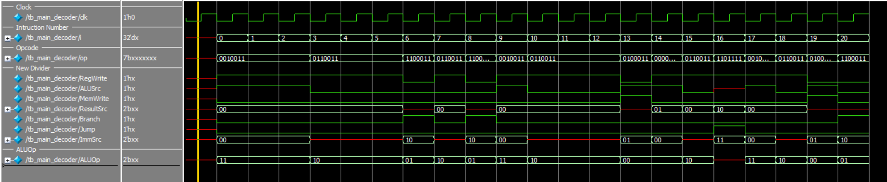
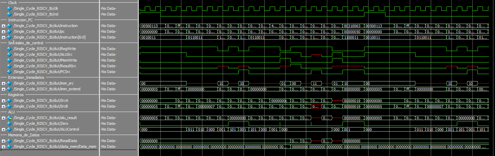

# Procesador Single Cycle RISCV

Este proyecto implementa una arquitectura de  un microprocesador RISCV que ejecuta la instruccion en un solo ciclo (Single Cycle) de reloj. 

## Características

- **Arquitectura**: Ciclo único (Single-Cycle)
- **ISA**: RISC-V RV32I (Base Integer Instruction Set)
- **Lenguaje de descripción**: Verilog

## Estructura del Proyecto

- `src/`: Contiene los módulos Verilog que definen la arquitectura del procesador.
- `testbench/`: Incluye los bancos de pruebas para verificar el funcionamiento de cada módulo y del procesador completo.
- `programs/`: Programas de prueba escritos en ensamblador RISC-V para validar la ejecución de instrucciones.}

## Módulos del Procesador RISC-V (Single Cycle)

| Módulo              | Función principal                                                                 |
|---------------------|------------------------------------------------------------------------------------|
| `ProgramCounter`    | Mantiene la dirección de la instrucción actual.                                   |
| `InstructionMemory` | Memoria ROM que almacena el conjunto de instrucciones del programa.               |
| `RegisterFile`      | Banco de registros (32 registros de 32 bits), con dos lecturas y una escritura.   |
| `ImmediateGenerator`| Extrae e interpreta los campos inmediatos según el tipo de instrucción (I, S, B…).|
| `ALUControl`        | Genera la señal de operación de la ALU a partir de la instrucción.                |
| `ALU`               | Unidad lógica-aritmética que ejecuta operaciones según la instrucción.            |
| `ControlUnit`       | Genera señales de control globales según el opcode.                               |
| `DataMemory`        | Memoria RAM para operaciones de carga/almacenamiento.                             |

## Instrucciones Implementadas En El Main_Decoder
El main decoder es el encargado de traducir el opcode a una serie de señales de control que determinan como se debe ejecutar la instruccion.

### Salida correspondiente del Main_Decoder
| # | .hex instruction |   op    |     instruction      | RegWrite | AluSrc | MemWrite | ResultSrc | Branch | Jump | ImmSrc | ALUOP |
|---|------------------|---------|----------------------|:--------:|:------:|:--------:|:---------:|:------:|:----:|:------:|:-----:|
| 1 | `00500113`       | 0010011 | ADDI x2, x0, 5       |    1     |   1    |    0     |    00     |   0    |  0   |  00    |  11   |
| 2 | `00C00193`       | 0010011 | ADDI x3, x0, 12      |    1     |   1    |    0     |    00     |   0    |  0   |  00    |  11   |
| 3 | `FF718393`       | 0010011 | ADDI x7, x3, -9      |    1     |   1    |    0     |    00     |   0    |  0   |  00    |  11   |
| 4 | `0023E233`       | 0110011 | OR   x4, x7, x2      |    1     |   0    |    0     |    00     |   0    |  0   |   X    |  10   |
| 5 | `0041F2B3`       | 0110011 | AND  x5, x3, x4      |    1     |   0    |    0     |    00     |   0    |  0   |   X    |  10   |
| 6 | `004282B3`       | 0110011 | ADD  x5, x5, x4      |    1     |   0    |    0     |    00     |   0    |  0   |   X    |  10   |
| 7 | `02728863`       | 1100011 | BEQ  x5, x7, 48      |    0     |   0    |    0     |    X      |   1    |  0   |  10    |  01   |
| 8 | `0041A233`       | 0110011 | SLT  x4, x3, x4      |    1     |   0    |    0     |    00     |   0    |  0   |   X    |  10   |
| 9 | `00020463`       | 1100011 | BEQ  x4, x0, 8       |    0     |   0    |    0     |    X      |   1    |  0   |  10    |  01   |
|10 | `00000293`       | 0010011 | ADDI x5, x0, 0       |    1     |   1    |    0     |    00     |   0    |  0   |  00    |  11   |
|11 | `0023A233`       | 0110011 | SLT  x4, x7, x2      |    1     |   0    |    0     |    00     |   0    |  0   |   X    |  10   |
|12 | `005203B3`       | 0110011 | ADD  x7, x4, x5      |    1     |   0    |    0     |    00     |   0    |  0   |   X    |  10   |
|13 | `402383B3`       | 0110011 | SUB  x7, x7, x2      |    1     |   0    |    0     |    00     |   0    |  0   |   X    |  10   |
|14 | `0471AA23`       | 0100011 | SW   x7, 84(x3)      |    0     |   1    |    1     |    X      |   0    |  0   |  01    |  00   |
|15 | `06002103`       | 0000011 | LW   x2, 96(x0)      |    1     |   1    |    0     |    01     |   0    |  0   |  00    |  00   |
|16 | `005104B3`       | 0110011 | ADD  x9, x2, x5      |    1     |   0    |    0     |    00     |   0    |  0   |   X    |  10   |
|17 | `008001EF`       | 1101111 | JAL  x3, 494         |    1     |   X    |    0     |    10     |   0    |  1   |  11    |  XX   |
|18 | `00100113`       | 0010011 | ADDI x2, x0, 1       |    1     |   1    |    0     |    00     |   0    |  0   |  00    |  11   |
|19 | `00910133`       | 0110011 | ADD  x2, x2, x9      |    1     |   0    |    0     |    00     |   0    |  0   |   X    |  10   |
|20 | `0221A023`       | 0100011 | SW   x2, 32(x3)      |    0     |   1    |    1     |    X      |   0    |  0   |  01    |  00   |
|21 | `00210063`       | 1100011 | BEQ  x2, x2, 0       |    0     |   0    |    0     |    X      |   1    |  0   |  10    |  01   |

### Wave de mi Main_decoder

## Instrucciones Implementadas En El Top `Single_Cycle_RISCV.v`

El módulo `Single_Cycle_RISCV` representa el diseño completo de un procesador RISC-V de un solo ciclo. Su función principal es **interconectar y controlar todos los módulos internos** para ejecutar instrucciones de forma secuencial. Dentro de este módulo se coordinan las siguientes tareas:

- **Program Counter (PC):** Incrementa o salta a la siguiente dirección de instrucción.
- **Instruction Fetch:** Lee la instrucción actual desde `InstructionMemory`.
- **Decodificación:** Extrae los registros fuente y destino, tipo de instrucción y señales de control a través de `ControlUnit`.
- **Lectura de registros:** Extrae los valores de los registros fuente desde `RegisterFile`.
- **Generación del inmediato:** Usa `ImmediateGenerator` para obtener el valor inmediato correcto.
- **ALU:** Realiza la operación aritmética o lógica indicada.
- **Data Memory:** Lee o escribe datos si la instrucción lo requiere (`LW`, `SW`).
- **Resultado final:** Decide si el resultado final viene de la ALU o la memoria, y lo escribe en el registro destino si corresponde.

### Wave de mi Top

En el wave se puede observar que esta dividido, en instruction_pc, tenemos el numero de la instruccion del archivo .hex, el oc counter (que suma de 4 en 4) y el opcode para saber que tipo de instruccion es.
Continuando en Señales de Control tenemos tenemos las señales que son bits generados por la Unidad de Control que activan o desactivan ciertas partes del procesador según la instrucción actual. Estan los inmediatos, el de source y el de extend, utilizado para ciertas instrucciones que utilizan los inmediatos. Los registros yo utilice lo que entran en el register file, ya que son los registros de la instruccion utilizados. Se encuentra tambien la ALU, donde aparece el resultado, y el alu control (utilizado para saber que tipo de operacion se hara), y por ultimo la memoria de datos del procesador, encargado de guardar y devolver datos en tiempo de ejecucion. 